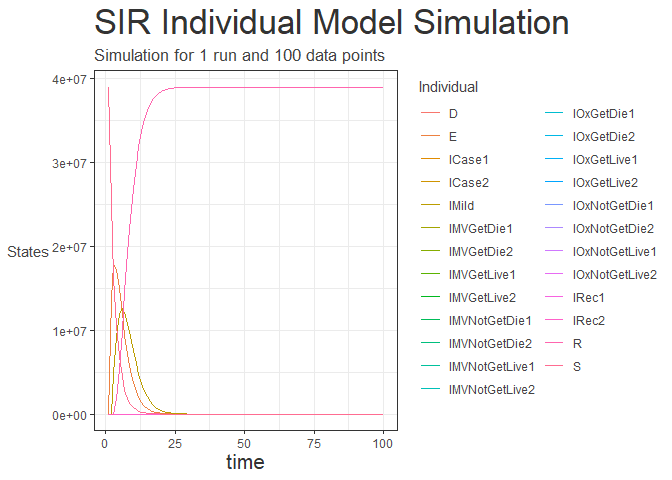

<!-- README.md is generated from README.Rmd. Please edit that file -->

# hypatia

<!-- badges: start -->

[](https://github.com/mrc-ide/hypatia/actions)
[](https://www.codefactor.io/repository/github/mrc-ide/hypatia)
[](https://codecov.io/github/mrc-ide/hypatia?branch=main)
<!-- badges: end -->

The goal of hypatia is to enable SQUIRE to be run on an individual basis
rather than aggregate

## Installation

You can install the released version of hypatia from
[CRAN](https://CRAN.R-project.org) with:

``` r
install.packages("hypatia")
devtools::install_github("ggplot2")
```

And the development version from [GitHub](https://github.com/) with:

``` r
# install.packages("devtools")
devtools::install_github("mrc-ide/hypatia")
```

and packages:

``` r
options(warn = - 1) 
library('remotes')
install_github('mrc-ide/individual')
library(individual)
```

## Example

This is an example showing how to run the simulation

    #> Warning: Use of `df$time` is discouraged. Use `time` instead.
    #> Warning: Use of `df$value` is discouraged. Use `value` instead.
    #> Warning: Use of `df$group` is discouraged. Use `group` instead.
    #> Warning: Use of `df$name` is discouraged. Use `name` instead.
    
    #> Warning: Use of `df$name` is discouraged. Use `name` instead.
    #> Warning in grid.Call(C_stringMetric, as.graphicsAnnot(x$label)): font family not
    #> found in Windows font database
    
    #> Warning in grid.Call(C_stringMetric, as.graphicsAnnot(x$label)): font family not
    #> found in Windows font database
    
    #> Warning in grid.Call(C_stringMetric, as.graphicsAnnot(x$label)): font family not
    #> found in Windows font database
    #> Warning in grid.Call(C_textBounds, as.graphicsAnnot(x$label), x$x, x$y, : font
    #> family not found in Windows font database
    #> Warning in grid.Call(C_stringMetric, as.graphicsAnnot(x$label)): font family not
    #> found in Windows font database
    
    #> Warning in grid.Call(C_stringMetric, as.graphicsAnnot(x$label)): font family not
    #> found in Windows font database
    #> Warning in grid.Call(C_textBounds, as.graphicsAnnot(x$label), x$x, x$y, : font
    #> family not found in Windows font database
    
    #> Warning in grid.Call(C_textBounds, as.graphicsAnnot(x$label), x$x, x$y, : font
    #> family not found in Windows font database
    
    #> Warning in grid.Call(C_textBounds, as.graphicsAnnot(x$label), x$x, x$y, : font
    #> family not found in Windows font database
    
    #> Warning in grid.Call(C_textBounds, as.graphicsAnnot(x$label), x$x, x$y, : font
    #> family not found in Windows font database
    
    #> Warning in grid.Call(C_textBounds, as.graphicsAnnot(x$label), x$x, x$y, : font
    #> family not found in Windows font database
    
    #> Warning in grid.Call(C_textBounds, as.graphicsAnnot(x$label), x$x, x$y, : font
    #> family not found in Windows font database
    
    #> Warning in grid.Call(C_textBounds, as.graphicsAnnot(x$label), x$x, x$y, : font
    #> family not found in Windows font database
    
    #> Warning in grid.Call(C_textBounds, as.graphicsAnnot(x$label), x$x, x$y, : font
    #> family not found in Windows font database
    
    #> Warning in grid.Call(C_textBounds, as.graphicsAnnot(x$label), x$x, x$y, : font
    #> family not found in Windows font database
    
    #> Warning in grid.Call(C_textBounds, as.graphicsAnnot(x$label), x$x, x$y, : font
    #> family not found in Windows font database
    
    #> Warning in grid.Call(C_textBounds, as.graphicsAnnot(x$label), x$x, x$y, : font
    #> family not found in Windows font database
    
    #> Warning in grid.Call(C_textBounds, as.graphicsAnnot(x$label), x$x, x$y, : font
    #> family not found in Windows font database
    
    #> Warning in grid.Call(C_textBounds, as.graphicsAnnot(x$label), x$x, x$y, : font
    #> family not found in Windows font database
    
    #> Warning in grid.Call(C_textBounds, as.graphicsAnnot(x$label), x$x, x$y, : font
    #> family not found in Windows font database
    
    #> Warning in grid.Call(C_textBounds, as.graphicsAnnot(x$label), x$x, x$y, : font
    #> family not found in Windows font database
    
    #> Warning in grid.Call(C_textBounds, as.graphicsAnnot(x$label), x$x, x$y, : font
    #> family not found in Windows font database
    
    #> Warning in grid.Call(C_textBounds, as.graphicsAnnot(x$label), x$x, x$y, : font
    #> family not found in Windows font database



## License

MIT © Imperial College of Science, Technology and Medicine
